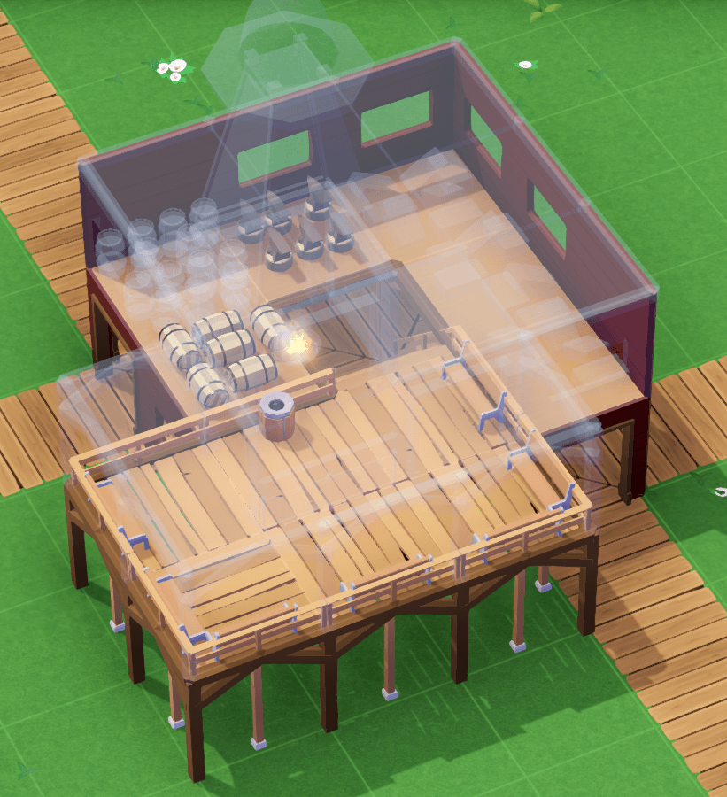
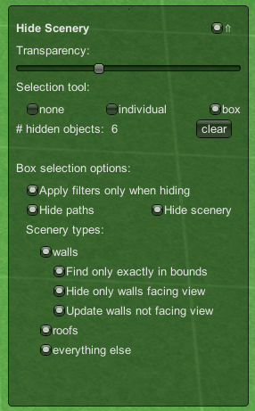
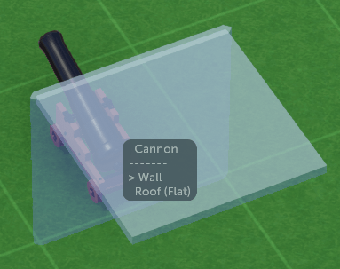
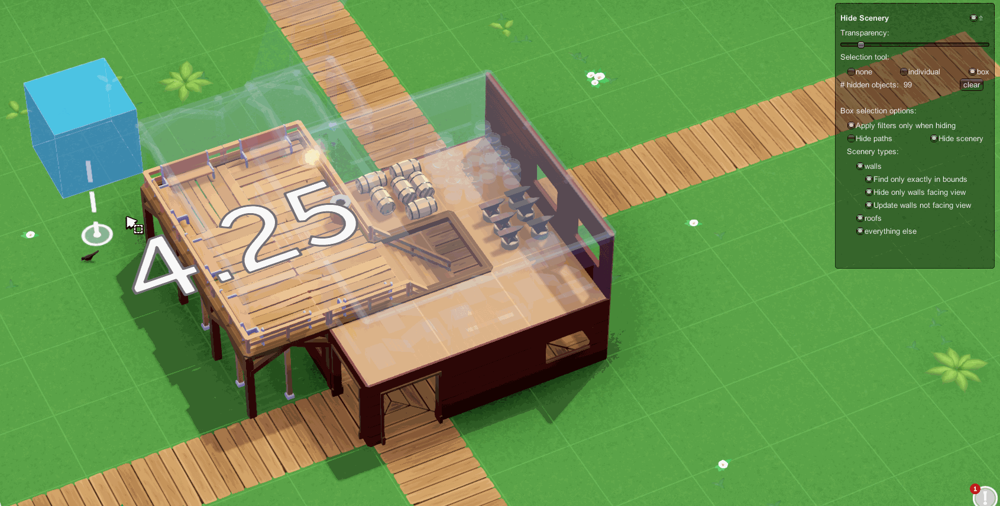
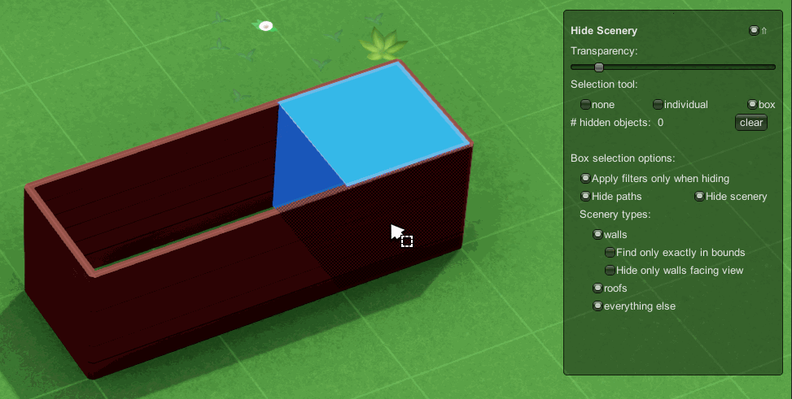
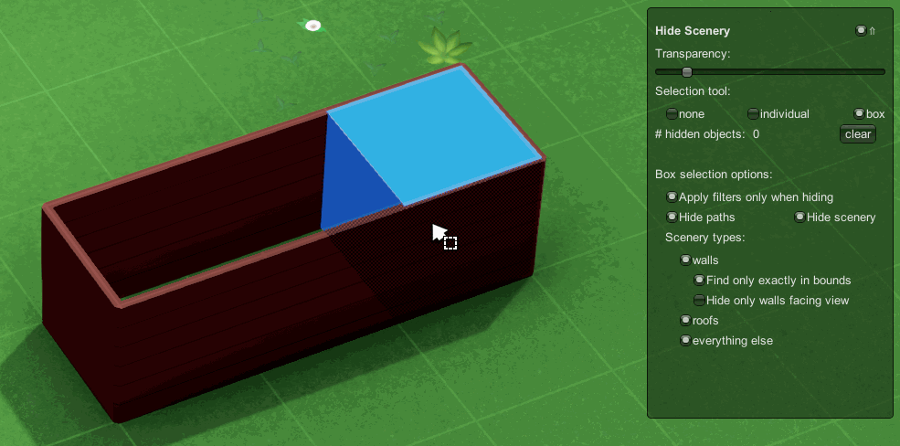
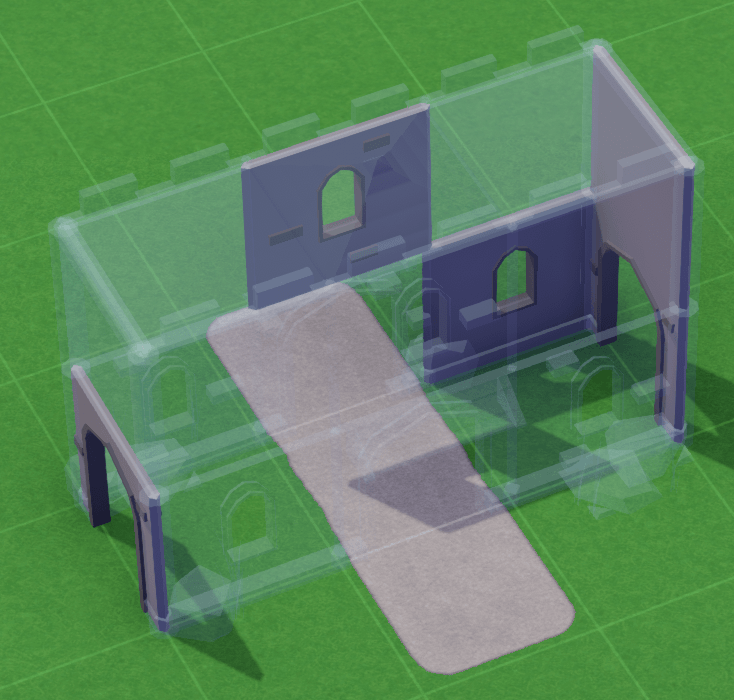
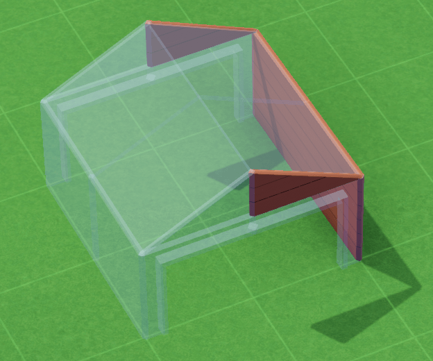

Hide Scenery
===============
Mod for [Parkitect](http://themeparkitect.com).  
Available on the [Steam Workshop](https://steamcommunity.com/sharedfiles/filedetails/?id=1624906296).

Select certain scenery or paths to hide, instead of just hide all scenery like Parkitects builtin functionality does.

# Installation
* Steam: Just subscribe to [the mod on the Steam Workshop](https://steamcommunity.com/sharedfiles/filedetails/?id=1624906296).
* Other:
  * Download the newest version of this mod from the [release page on GitHub](https://github.com/Craxy/Parkitect-HideScenery/releases).
  * Extract the zip file into `{MyDocuments}/Parkitect/Mods/`.

This mod doesn't alter savegames -> You can disable and remove this mod at any time without any impact on savegames, scenarios, etc..

# Usage
* Enable/Disable tool via key `.` (Period)

  
* `individual` selection:
  * left click: hide object
  * right click: unhide object
  * The tooltip shows the visible object under the mouse and all hidden objects in front of the visible object.
      
    * Over line: Name of visible object
    * Under line: List of hidden objects ordered by their distance from far to close. By default the farthest object is selected.
      * `+`/`-`: change selected hidden object which get visible again after right click
* `box` selection:
  * left click: hide objects in area
  * right click: unhide objects in area
  * Filters to limit affected objects:
    * Walls/Roofs matched by category ("Structures/Walls", "Structures/Roofs") and name (contains "wall", "roof") 
    * Parkitects box selection picks walls that only tangents the box but are placed on a outside tile. "Find only exactly in bounds" changes this behaviour for walls. See more in the [Notes](#notes) section [↴](#issue_boxselection).
    * "Hide only walls facing view" hides only walls which were placed on the tile side towards the camera (like it's the case in the [first image](#preview_image)).  
    For rehiding via box selection it can be toggled whether already hidden walls should be made visible if they don't face the camera or should stay hidden:
      
      
      * There are a couple of caveats with this option. See more in the [Notes](#notes) section below [↴](#problems_HideOnlyWallsFacingView).
* `Clear`: Unhide all currently hidden objects

## Shortcuts
All shortcuts can be changed in the Settings menu under Controls in the "Hide Scenery" section. This section is only available in a Park and not in the Main Menu.

* Enable/Disable Hide Scenery: `.`
  * without GUI: `,`
* Select `none`: `Keypad7`
* Toggle `individual` selection: `Keypad8`
  * Change selected hidden object: `+`/`-` (Parkitect keys for "Increase/Decrease object size")
* Toggle `box` selection: `Keypad9`
* `Clear` all: `Keypad3`

Both `individual` as well as `box` selection can be exited via `Esc` too (just like every other tool in Parkitect).

## Notes
* The hidden objects have the same issues as objects hidden by Parkitect:
  * Path attachments like benches can still be selected and deleted -- even when hidden because its path is hidden
  * Box selections (like Blueprint or Bulldozer) still selected hidden objects (while individual selection can't select hidden things)
  * Box selection selects alls object that are inside the box or at least extend into it. Unfortunately that means things that are build on the side of a tile might still be selected because they range into the other tile. That's for example the case for walls:
    
  For walls this can be changed via "Find only exactly in bounds:
    
  But this doesn't work on all things build on the side of a tile -- or even for all walls. Also it only works for walls on the side, but not on top of each other.
* Unlike the box selections in Parkitect (like Bulldozer), the selection box can be raised in `0.25` steps. That can be used to hide walls but not the floor: Just raise the selection box `¼`. This also prevents walls directly below the current level to be hidden too. The [preview image](#preview_image) was created this way. That's noticeable in some scenery: While lying barrels are visible, standing ones are hidden.
* "Hide only walls facing view" has some problems:
  * A wall must be placed at the correct side. In Parkitect placing a wall on a different tile but same border usually doesn't result in different visuals, but is than handled different: (`Castle Wall Gate`, included Blueprint in Parkitect)  
    
  Here the door on the right and a couple of walls on the back were placed on other tiles.  
  Additional some walls can't even be placed on the same side because there's only one variant. That's for example the case for slopes:  
    
  Both front slopes should be hidden and both in the back should be visible. But because they had to be placed on different tile sides that's not the case.
  * Some walls can't can't be hidden by view and are therefore always hidden (as long as hide walls is activated). For example that's the case for Arches as seen in the screenshot above.  
  Technical reason: Most walls have stored on which tile side they are placed. That info is than used to determine which walls are facing the current view. But not all walls have this info, but instead are just normal deco without this datum.

# Additional References
## Release notes
Listed in [RELEASE_NOTES.md](./RELEASE_NOTES.md) and on the [release page](https://github.com/Craxy/Parkitect-HideScenery/releases).  
A simplified changelog can also be found [on the Change Notes page on the Steam Workshop page](https://steamcommunity.com/sharedfiles/filedetails/changelog/1624906296) for this mod.

## Issues
Please report issues via the [issue tracker on GitHub](https://github.com/Craxy/Parkitect-HideScenery/issues).  
If this mod is responsible for a crash or an error/exception please include your *output_log.txt*. Copy this log file immediately after the crash -- its content is cleared for each Parkitect start.  

*output_log.txt* is Parkitects log file, located at 
* Windows: `%USERPROFILE%\AppData\LocalLow\Texel Raptor\Parkitect\output_log.txt`
* Linux: `~/.config/unity3d/Texel Raptor/Parkitect/Player.log`
* Mac: `~/Library/Logs/Unity/Player.log`

## Source code
[Craxy/Parkitect-HideScenery on GitHub](https://github.com/Craxy/Parkitect-HideScenery)
