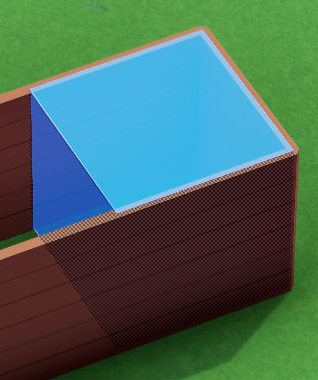
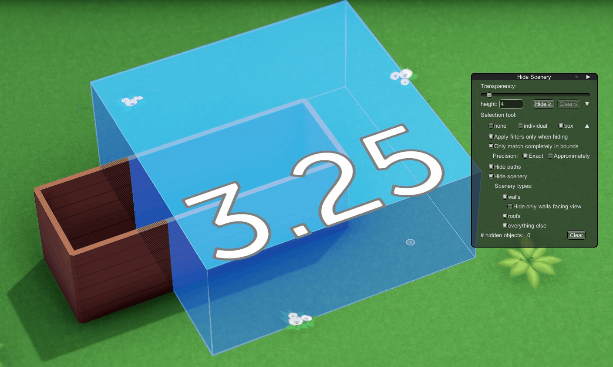

Hide Scenery
===============
Mod for [Parkitect](http://themeparkitect.com).  
Available on the [Steam Workshop](https://steamcommunity.com/sharedfiles/filedetails/?id=1624906296).

Select certain scenery or paths to hide, instead of just hide all scenery like Parkitects builtin functionality does.

# Installation
* Steam: Just subscribe to [the mod on the Steam Workshop](https://steamcommunity.com/sharedfiles/filedetails/?id=1624906296).
* Other:
  * Download the newest version of this mod from the [release page on GitHub](https://github.com/Craxy/Parkitect-HideScenery/releases).
  * Extract the zip file into `{MyDocuments}/Parkitect/Mods/`.

This mod doesn't alter savegames -> You can disable and remove this mod at any time without any impact on savegames, scenarios, etc..

# Usage
* Enable/Disable tool via key `.` (Period)  

* Window can be moved around
  * 2nd button (from right) in title bar controls if window can be moved or is pinned:
    * `~`: Window can be moved
    * `!`: Window is pinned and cannot be moved
* Window can be minimized
  * 1st button (from right) in title bar
  * Minimized window is basically just a reminder that `Hide Scenery` is active:  
    
  * Pin button isn't displayed in minimized window, but has same state as in maximized window.
* For an even smaller indicator open tool via `,` (Comma)  
  -> just a tiny `HS` in the upper right corner

### Tools
* Hide by height:
  * `Hide ≥`: Hide all Scenery with >= specified height
    * Note: This might take some time for parks with a lot of scenery!
  * `Clear ≤`: Clear all hidden Scenery with <= specified height
    * Only available when there are hidden objects
* selection tool:
  * `individual` selection:
    * left click: hide object
    * right click: unhide object
    * The tooltip shows the visible object under the mouse and all hidden objects in front of the visible object.
        
      * Over line: Name of visible object
      * Under line: List of hidden objects ordered by their distance from far to close. By default the farthest object is selected.
        * `+`/`-`: change selected hidden object which get visible again after right click
  * `box` selection:
    * left click: hide objects in area
    * right click: unhide objects in area
* `Clear`: Unhide all currently hidden objects

### Options
Options are available for `Hide by height` and `box` selection.  
Options are hidden by default. Click on `▼` to display the corresponding options.

* `Apply filters only when hiding`: When enabled: ignore all following filter options when unhiding objects with the corresponding tool.
* `Only match completely in bounds`: When disabled all objects touching the selected area (box with `box selection`, everything above/below height for `hide by height`) get selected and hidden. That's the same behaviour as Parkitect's Bulldozer tool.  
    
  When this toggle enabled the selection is limit to objects completely in bounds:  
    
  Even though two walls are touching the selection box, these don't get hidden.  
  This can be adjusted with several settings:
  * `Precision`:
    * `Exact`: Only objects that are completely in bounds get selected.  
      In the example above nothing would get hidden with this settings enabled: All walls aren't completely inside the selection box but stand out a tiny bit:  
        
      Instead hiding the same walls requires selecting the surrounding tiles too. Additional the walls are slightly higher than the `1` height. As such the selection must also expand slightly above:
        
      This is useful when you want to hide something inside an area, but not it's border.
    * `Approximately`: The actual bounding test is slightly more generous and allows objects to poke slightly out of the actual selection area (by `ε`):  
        
      -> `ε` broadens the actual search test area. For example with `height=4` and `ε = 0.05`, objects can already start at height `4-0.05=3.95`
      * Especially useful for walls and roof slopes: Both jut quite often into neighboring tiles (on same level as well as upper/lower height)
      * `ε` can be negative. Useful for excluding walls or other objects close to tile border
* `Hide Paths`, `Hide Scenery` and further filtering based on scenery types (Wall, Roof, Everything else):
  * `Hide only walls facing view`: hides only walls which were placed on the tile side towards the current camera (like it's the case in the [first image](#preview_image)).  
      
    For rehiding via box selection it can be toggled whether already hidden walls should be made visible if they don't face the camera or should stay hidden: 
      
      
      * There are a couple of caveats with this option. See more in the [Notes](#notes) section below [↴](#problems_HideOnlyWallsFacingView).

## Shortcuts
All shortcuts can be changed in the Settings menu under Controls in the "Hide Scenery" section. This section is only available in a Park and not in the Main Menu.

* Enable/Disable Hide Scenery: `.`
  * without GUI: `,`
* Select `none`: `Keypad7`
* Toggle `individual` selection: `Keypad8`
  * Change selected hidden object: `+`/`-` (Parkitect keys for "Increase/Decrease object size")
* Toggle `box` selection: `Keypad9`
* `Clear` all: `Keypad3`

Both `individual` as well as `box` selection can be exited via `Esc` too (just like every other tool in Parkitect).

## Notes
* The hidden objects have the same issues as objects hidden by Parkitect:
  * Path attachments like benches can still be selected and deleted -- even when hidden because its path is hidden
* Unlike the box selections in Parkitect (like Bulldozer), the selection box can be raised in `0.25` steps. That can be used to hide walls but not the floor: Just raise the selection box `¼`. This also prevents walls directly below the current level to be hidden too. The [preview image](#preview_image) was created this way. That's noticeable in some scenery: While lying barrels are visible, standing ones are hidden.
* "Hide only walls facing view" has some problems:
  * A wall must be placed at the correct side. In Parkitect placing a wall on a different tile but same border usually doesn't result in different visuals, but is than handled different: (`Castle Wall Gate`, included Blueprint in Parkitect)  
    
  Here the door on the right and a couple of walls on the back were placed on other tiles.  
  Additional some walls can't even be placed on the same side because there's only one variant. That's for example the case for slopes:  
    
  Both front slopes should be hidden and both in the back should be visible. But because they had to be placed on different tile sides that's not the case.
  * Some walls cannot be hidden by view and are therefore always hidden (as long as hide walls is activated). For example that's the case for Arches as seen in the screenshot above.  
  Technical reason: Most walls have stored on which tile side they are placed. That info is than used to determine which walls are facing the current view. But not all walls have this info, but instead are just normal deco without this datum.

# Additional References
## Release notes
Listed in [RELEASE_NOTES.md](./RELEASE_NOTES.md) and on the [release page](https://github.com/Craxy/Parkitect-HideScenery/releases).  
A simplified changelog can also be found [on the Change Notes page on the Steam Workshop page](https://steamcommunity.com/sharedfiles/filedetails/changelog/1624906296) for this mod.

## Issues
Please report issues via the [issue tracker on GitHub](https://github.com/Craxy/Parkitect-HideScenery/issues).  
If this mod is responsible for a crash or an error/exception please include your *output_log.txt*. Copy this log file immediately after the crash -- its content is cleared for each Parkitect start.  

*output_log.txt* is Parkitects log file, located at 
* Windows: `%USERPROFILE%\AppData\LocalLow\Texel Raptor\Parkitect\output_log.txt`
* Linux: `~/.config/unity3d/Texel Raptor/Parkitect/Player.log`
* Mac: `~/Library/Logs/Unity/Player.log`

## Source code
[Craxy/Parkitect-HideScenery on GitHub](https://github.com/Craxy/Parkitect-HideScenery)
